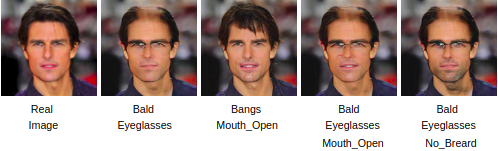

# AttGAN: Facial Attribute Editing by Only Changing What You Want

Facial attribute editing aims to manipulate single or multiple attributes of a face image, i.e., to generate a new face with desired attributes while preserving other details.

Total 13 attributes are manipulated to generate image
['Bald', 'Bangs', 'Black_Hair', 'Blond_Hair', 'Brown_Hair','Bushy_Eyebrows', 'Eyeglasses', 'Male', 'Mouth_Slightly_Open', 'Mustache','No_Beard', 'Pale_Skin', 'Young']

## Installation

Several libraries are needed to be installed for training to work. I will assume that everything is being installed in an Anaconda installation on Ubuntu, with PyTorch installed.

Install PyTorch if you haven't already.And also install all libraries mentioned in requirements.txt

If you want to setup from this repository then run bellow command:
``` bash
git clone https://github.com/Adeebshad/Machine_Learning_Project.git
```

Finaly run the following command to ensure that everything is being installed correctly.
```bash
pip install -r requirements.txt
```

# Datasets

CelebFaces Attributes Dataset (CelebA) is a large-scale face attributes dataset with more than 200K celebrity images, each with 40 attribute annotations. The images in this dataset cover large pose variations and background clutter. CelebA has large diversities, large quantities, and rich annotations, including

   * 10,177 number of identities,

   * 202,599 number of face images, and

   * 5 landmark locations, 40 binary attributes annotations per image.


Download the CelebA dataset and put images and attributes text file in dataset folder.
* Dataset
  * [CelebA](http://mmlab.ie.cuhk.edu.hk/projects/CelebA.html) dataset
    * [Images](https://www.dropbox.com/sh/8oqt9vytwxb3s4r/AADSNUu0bseoCKuxuI5ZeTl1a/Img?dl=0&preview=img_align_celeba.zip) should be placed in `./dataset/CelebA/*.jpg`
    * [Attribute labels](https://www.dropbox.com/sh/8oqt9vytwxb3s4r/AAA8YmAHNNU6BEfWMPMfM6r9a/Anno?dl=0&preview=list_attr_celeba.txt) should be placed in `./dataset/list_attr_celeba.txt`

# Preprocess

It creates three manifest files  in dataset root directory. 

   * train_manifest.txt

   * test_manifest.txt, and

   * valid_manifest.txt.

Before starting Training or testing. It needs to preprocess dataset first. Run the follwing command to preprocess dataset.
This will split the attributes text file into three portion that is mentioned above. 

```bash
python data/preprocess.py --root_path "your-root-path-toproject-directory" --manifest_file_path 'your_path'

Example:
   python data/preprocess.py --root_path '/home/incentive/Dataset/Final Checking' --manifest_file_path 'data/list_attr_celeba.txt'

```


# Training

Run the follwing command to train AttGAN model. It trains on training dataset and save checkpoint and other sample generated images from valid dataset in output directory.

```bash
python train.py --root_path "your-root-path-toproject-directory" --image_container_path "your path" --train_manifest_file_path "your_path" --validation_manifest_file_path "your_path"

Example:
   python train.py --root_path '/home/incentive/Dataset/Final Checking' --image_container_path "data/CelebA" --train_manifest_file_path 'data/train_manifest.txt' --validation_manifest_file_path 'data/valid_manifest.txt'

```
# Save model

After training model put the saved model weights in weights folder.
```bash
mkdir weights
```
# Test

Run the follwing command to test AttGAN model on test dataset.This will generate attribute wise images from test dataset.

```bash
python test.py --root_path "your-root-path-toproject-directory" --weights_path "name of model weight"

Example: 
   python test.py --root_path '/home/incentive/Dataset/Final Checking' --weights_path 'src/weights/weights.149.pth'

```
##### To test with single attribute editing.
original, reconstruction and 13 attributes image are given sequence wise.


# Inference

Run the follwing command to manipulate attributes on single image.Saved model put in weights folder.You need to pass the 13 existing attributes of input image and then pass the list of index from 13 attributes that you want to change.After running the inference file it will generate images by changing that given.

```bash
python inference.py --root_path "your-root-path-toproject-directory" --image_folder_name "your-img-folder-name" --image_fname "your_imgfile-name" --weights_path "name of model" --input_img_attr "list of 13 attributes" --index "list of index of 13 attribute that you want to change"

Example: 
   python inference.py --root_path '/home/incentive/Dataset/Final Checking' --image_folder_name 'custom' --image_fname 'Akbar_jm.jpg' --weights_name 'src/weights/weights.149.pth' --input_img_attr 1 0 0 0 1 1 0 1 1 0 1 0 0 --index 3 10
```
Suppose bellow images show the generated image of input image of tom-cruise, then generate images of different attributes.




# Extras

If you want to know about specific files or its function then follow the following command

* file information
```bash
python filename.py --help
```

* function information
```bash
python #goto python bash

from filename import *
help(function_name)

```
